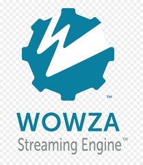
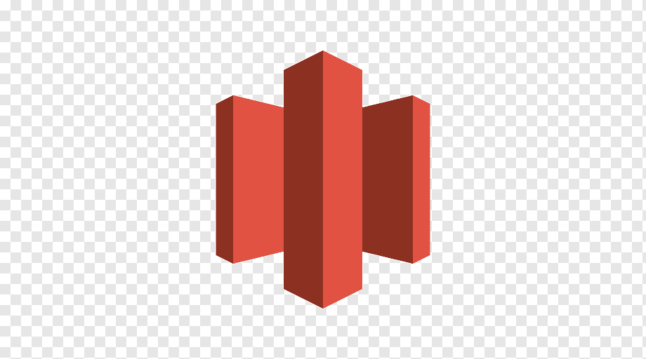
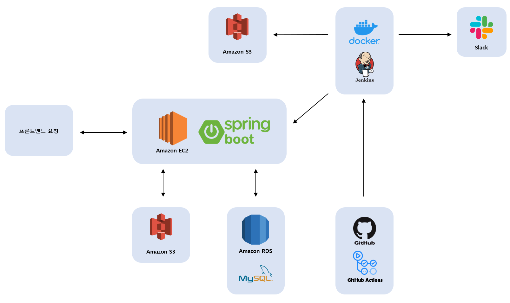

## 💁 웹 서비스 소개
***
IT 개발 입문자를 대상으로 양질의 강의를 무료로 제공하는 인터넷 강의 스트리밍 서비스

👉 [바로가기](https://codeunicorn.kr/)

## 🛠 기술 스택

### Back-end
***
|  |  |
|:-----------------------------------------------------:|:---------------------------------------------------------------------:|
|                        Kotlin                         |                              Spring boot                              |

|    |
|:----------------------------------------------------------------------------:|
|                               Spring Data JPA                                |

|  |
|:----------------------------------------------------------------:|
|                              MySQL                               |

### Video Streaming
***
|  |
|:----------------------------------------------------------------:|
|                      Wowza Streaming Engine                      |

### Infra
***
|  |  |
|:------------------------------------------------------------------:|:-----------------------------------------------------------------:|
|                              AWS EC2                               |                              AWS S3                               |

### CI/CD
***
|  |  |
|:-----------------------------------------------------------------:|:---------------------------------------------------------------------:|
|                          Github Actions                           |                                Jenkins                                |

### Version Control
***
|  |   |
|:--------------------------------------------------------------:|:------------------------------------------------------------------:|
|                              Git                               |                               GitHub                               |

## 💡 주요 기능
***
|         기능          |                             내용                             |
|:-------------------:|:----------------------------------------------------------:|
|     소셜 로그인 서비스      |           네이버 및 구글 계정을 통해 로그인할 수 있는 서비스를 제공합니다.            |
| 카테고리 별 코스 정보 제공 서비스 |               카테고리를 기준으로 필터링된 코스 정보를 제공합니다.                |
|  인기 순 코스 정보 제공 서비스  |                관심 등록 수를 기준으로 코스 정보를 제공합니다.                 |
|  최신 순 코스 정보 제공 서비스  |                 코스 등록일을 기준으로 코스 정보를 제공합니다.                 |
|      코스 검색 서비스      |             이름을 기준으로 코스를 검색할 수 있는 서비스를 제공합니다.              |
|    관심 코스 목록 서비스     | 관심 코스 목록 등록을 통해 등록한 코스 정보를 관심 코스 목록 페이지에서 한 번에 확인할 수 있습니다. |
| 현재 수강 중인 코스 목록 서비스  | 수강 코스 목록 등록을 통해 등록한 코스 정보를 수강 코스 목록 페이지에서 한 번에 확인할 수 있습니다. |
|     강의 스트리밍 서비스     |           현재 수강 중인 코스의 강의를 시청할 수 있는 서비스를 제공합니다.            |

## 📂 프로젝트 구성도
***
|                      아키텍처(Architecture)                       |
|:-------------------------------------------------------------:|
|  |

|                                                    개체-관계 모델(ERD)                                                    |
|:-------------------------------------------------------------------------------------------------------------------:|
|  |

## 👪 개발 팀 소개
***
| Frontend | Backend | Backend |
|:--------:|:-------:|:-------:|
|  Woody   |   Ron   |  Alvin  |

|  이름   |    역할    |                                                    개발 내용                                                    |
|:-----:|:--------:|:-----------------------------------------------------------------------------------------------------------:|
| Woody | Frontend |                                                  프론트엔드 개발                                                   |
|  Ron  | Backend  | API 설계 DB 설계 로그인 및 회원가입 서비스 개발 회원정보 수정 서비스 개발 현재 수강 중인 코스 목록 서비스 개발 강의 스트리밍 서비스 개발 |
| Alvin | Backend  |                               CI/CD 세팅 관심 코스 목록 서비스 개발 코스 검색 서비스 개발                               |

## 📅 개발 기간
***
22.05.16. ~ 22.07.15.

## 프로젝트 진행 중 고민한 것들

[JWT가 아닌 세션을 선택하게 된 이유](https://rift-crabapple-418.notion.site/JWT-76ab39d343944813b8d2e81c0ef7670b)

[ORM으로 JPA를 선택하게 된 이유](https://rift-crabapple-418.notion.site/ORM-JPA-ffc285dc3b294ce280c1e953a9b0164d)

[스트리밍 프로토콜로 HLS를 선택하게 된 이유](https://rift-crabapple-418.notion.site/HLS-358d8a68ffd64e29ae19cc52f2837b04)

## 트러블 슈팅 경험

[Multipart/form-data 요청의 PATCH 미지원으로 인한 사용자 정보 업데이트 API 메소드 변경](https://rift-crabapple-418.notion.site/Multipart-form-data-PATCH-API-64e3afae391044df83719af027b0ff56)

[사용자 정보 업데이트 API 비동기 처리 시 CompletedFuture 적용기](https://rift-crabapple-418.notion.site/API-CompletedFuture-e5d712b495304d25af2e54aafeac66e6)

